# Memory Board

## Visão Geral
Essa é uma aplicação frontend que reimagina o conceito tradicional de *"Memory Board"* em um ambiente digital. Originalmente, um Memory Board é uma ferramenta física usada para organizar e exibir memórias visuais, como fotos, cartões postais e lembranças. Ele serve como um lembrete tangível de momentos especiais, experiências significativas ou mesmo personalidades importantes na vida de alguém.

Seu objetivo principal é fornecer aos usuários uma plataforma digital onde eles possam:

- **Capturar Memórias:** Os usuários podem realizar o upload de suas memórias, ou seja, arquivos de imagens.

- **Organizá-las:** A aplicação permite que os usuários organizem suas imagens de forma personalizada, semelhante à disposição física tradicional.

- **Persisti-las:** Através do uso do LocalStorage, o Memory Board garante que as memórias permaneçam acessíveis e intocadas entre sessões de uso.

Este projeto é desenvolvido como parte de um esforço para aprimorar minhas habilidades de desenvolvimento frontend e serve como um exemplo prático das tecnologias e técnicas que domino. É também uma expressão do meu apreço pela nostalgia e pelo poder da memória e portanto da história em nossa vida cotidiana.

## Sumário
- [Visão Geral](#visão-geral)
- [Sumário](#sumário)
- [Produção](#produção)
- [Tecnologias Utilizadas](#tecnologias-utilizadas)
- [Principais Features](#principais-features)
  - [1. Componente de Dropzone](#1-componente-de-dropzone)
  - [2. State Management com Zustand](#2-state-management-com-zustand)
  - [3. Compressão de Imagens e Conversão para Base64](#3-compressão-de-imagens-e-conversão-para-base64)
  - [4. Context Menu Customizado](#4-context-menu-customizado)
  - [5. Persistência de Dados em LocalStorage](#5-persistência-de-dados-em-localstorage)
- [Instalação e Execução Local](#instalação-e-execução-local)
- [Arquitetura do Software](#arquitetura-do-software)
- [Créditos e Direitos Autorais](#créditos-e-direitos-autorais)

## Produção
Essa aplicação está disponível em ambiente de produção, pela **[Vercel](https://vercel.com/)**, através do link abaixo:

<a href="https://memoryboardio.vercel.app" target="_blank" style="font-size: 32px">
  memoryboardio.vercel.app
</a>

## Tecnologias Utilizadas
<div style="display: flex; gap: 2px;">
  <a href="https://www.typescriptlang.org/">
    
  </a>

  <a href="https://react.dev">
    
  </a>

  <a href="https://react-dropzone.js.org/">
    
  </a>

  <a href="https://react-icons.github.io/react-icons/">
    
  </a>

  <a href="https://docs.pmnd.rs/zustand/getting-started/introduction">
    
  </a>

  <a href="https://styled-components.com/">
    
  </a>

  <a href="https://www.framer.com/motion/">
    
  </a>
</div>

## Principais Features

### 1. Componente de Dropzone
A principal feature dessa aplicação é sem dúvidas a capacidade do usuário realizar o envio de suas memórias, ou seja, seus arquivos de imagem.

Ele pode fazê-lo de duas maneiras, arrastando as imagens para o menu de importação, ou simplesmente clicando no mesmo menu.

<div style="display: flex;flex-flow: column; gap: 5px">
  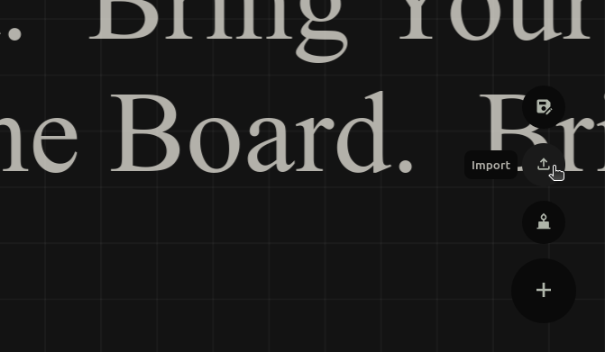

  > Preview do botão responsável pela operação de importação.

  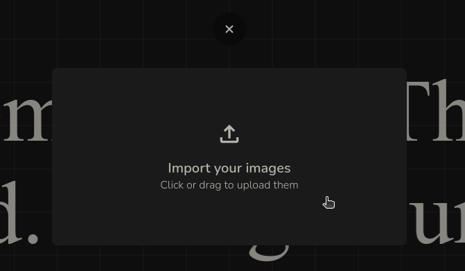

  > Preview do modal de importação.
</div>

#####
Isso tudo é possível graças ao framework **[React Dropzone](https://react-dropzone.js.org/)**, que facilita a implementação do `<input />` responsável por realizar o upload dos arquivos.

Essa implementação em código fica assim:

<div style="display: flex;flex-flow: column; gap: 5px">

  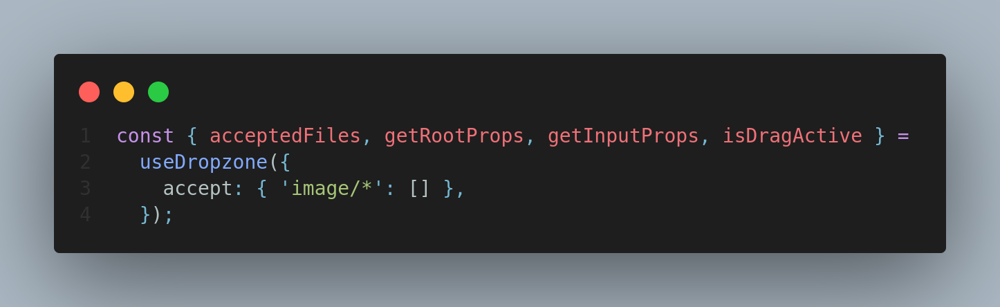


  > Bloco de código jsx que desestrutura alguns dos objetos retornados pelo custom hook useDropzone, que serão utilizados no jsx e em outras funções.

 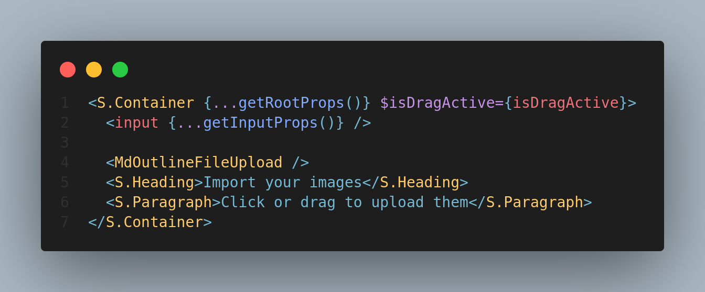

  > Bloco de código jsx utilizando os objetos retornados pelo método getRootProps() e getInputProps() do custom hook useDropzone.
</div>

### 2. State Management com Zustand

Após as imagens serem importadas, é necessário lidar com elas, para que possam ser acessadas por outros componentes.

Para tal, fora utilizado o framework **Zustand**, criando algumas *Stores*, dentre as quais, a `polaroidStore`, que trata os dados de importação.

<div style="display: flex;flex-flow: column; gap: 5px">
  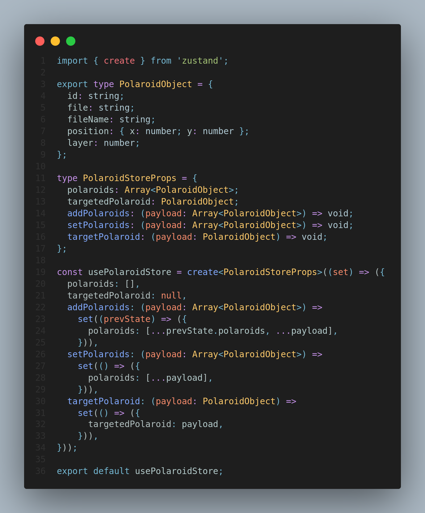

  > Zustand store responsável pelos arquivos importados.

  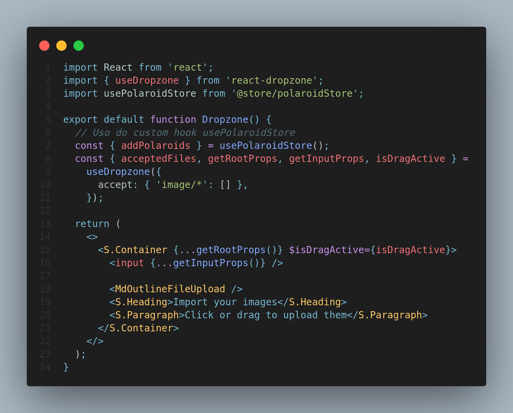

  > Importação do custom hook no componente Dropzone.
</div>

Assim, utilizando uma *Handler Function*, os arquivos importados, salvos no array `acceptedFiles` são salvos "globalmente", ao utilizar o método `addPolarids`:

<div style="display: flex;flex-flow: column; gap: 5px">
  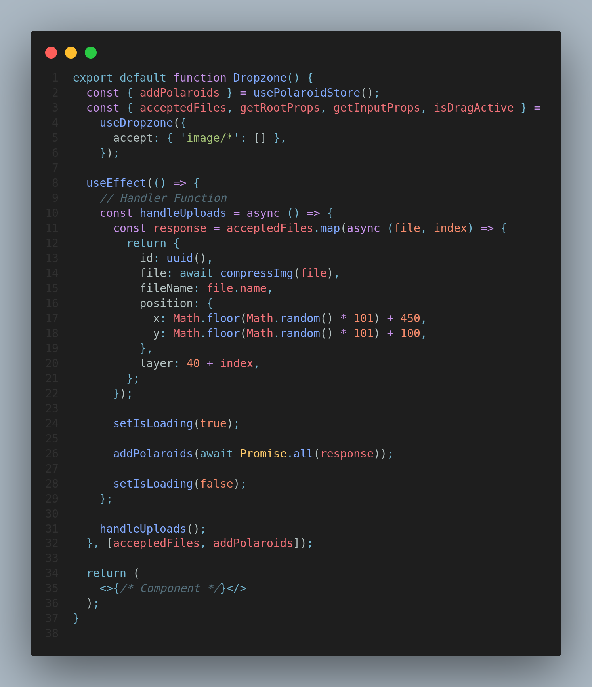

  > Utilização do método `addPolaroids`, através da função, handleUploads.
</div>

Isso faz com que o anterior array de `Files`(`acceptedFiles`), retornado pelo hook `useDropzone`, seja mapeado como um novo array do tipo `PolaroidObject`, apresentado no bloco de código da `polaroidStore` agora com novas informações.


### 3. Compressão de Imagens e Conversão para Base64

Dentre as informações salvas no tipo `PolaroidObject`, encontrasse a chave `file`. Inicialmente, esse valor guardava o proprio objeto `File`, padrão do JavaScript para lidar com arquivos enviados. No entanto isso faria com que a aplicação começasse a perder performance considerávelmente. Primeiro porque o próprio tipo File, apesar de ser um objeto é um classe dificil de se lidar, por exemplo, não é possível enviá-la ao *LocalStorage* como json e recuperá-la, esse valor acaba se "corrompendo" no meio do processo. E também para que a mesma seja renderizada, teria de ser convertida em em uma Uri.

Além disso, o tamanho das imagens não estão sob o controle da aplicação, ou seja, em teoria o usuário pode enviar uma imagem de qualquer tamanho, e quanto maior a mesma fosse, mais performance a aplicação perderia.

Por isso, na função `handleUploads` previamente exposta, cada `File` dentro do array`acceptedFiles`, não é somente salvo no novo objeto `PolaroidObject`, como também é antes comprimido e convertido numa string `base64`.

<div style="display: flex;flex-flow: column; gap: 5px">
  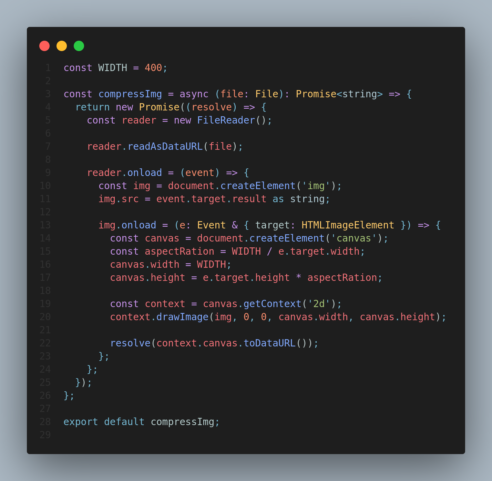

  > Função "compressImg".
</div>

### 4. Context Menu Customizado

Depois que as imagens são importadas, e seus valores mapeados como componentes `Polaroid`, podem ser facilmente movidas com o atributo `drag` do framework **Framer Motion**. Mas não basta apenas movê-las pela tela, é necessário melhor organizá-las, e para isso, funcionalidades como: **trazer para frente**, **enviar para trás** e **apagar**, são imprescindíveis.

Assim fora desenvolvido um *Context Menu* personalizado. Ao clicar com o botão direito em uma imagem, ela é salva na *PolaroidStore* como `targetedPolaroid`, e assim seus dados são usados para manipular o array `polaroids`.

<div style="display: flex;flex-flow: column; gap: 5px">
  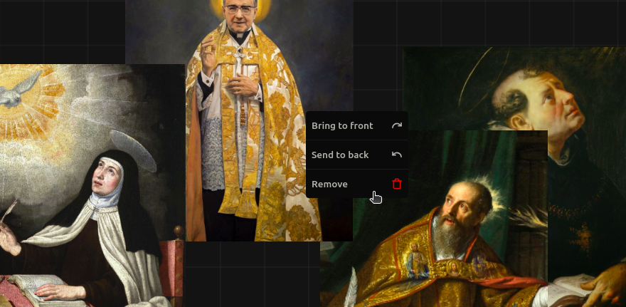

  > UI do componente ContextMenu ao clicar com o botão direito sobre um componente Polaroid.
</div>

### 5. Persistência de Dados em LocalStorage

Com os dados das imagens, facilmente manipuláveis, agora como uma string `base64`. É muito simples persistir esses dados em sessões de *LocalStorage*.

Para isso, foi desenvolvido um custom hook, chamado `useLocalStorage`, que salva não somente as imagens na chave `file` de cada `PolaroidObject`, mas também todas suas outras chaves como também sua `position`. Bastando um clique no botão de salvar.

<div style="display: flex;flex-flow: column; gap: 5px">
  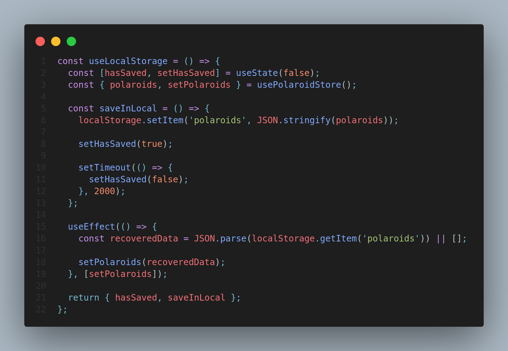

  > Custom hook useLocalStorage.

  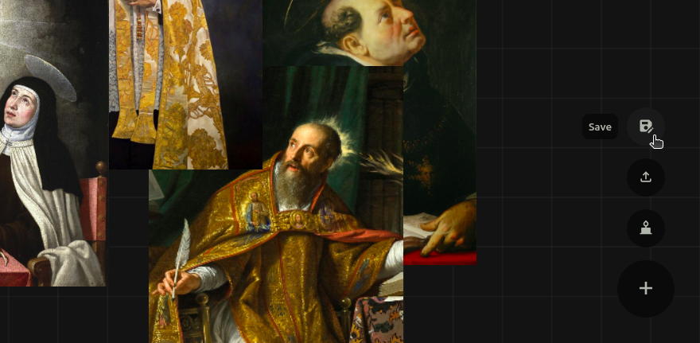

  > Action responsável por persistir os dados.

  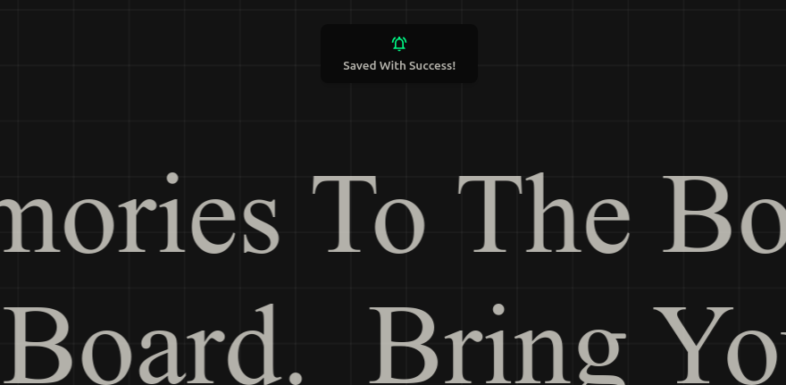

  > UI do componente Notification, demonstrando que a persistência dos dados foi realizada com sucesso.
</div>

## Instalação e Execução em Ambiente de Desenvolvimento

Para aqueles que queiram executar a aplicação localmente, é possível fazê-lo em simples passos:

1. Clone o projeto em sua máquina:

```cli
git clone git@github.com:fnandesrafael/memoryboard.git
```

2. Acesse o diretório raiz do projeto:

```cli
cd memoryboard
```

3. Instale as dependências, utilizando seu gerenciador de pacotes Node.js, como `npm`, `yarn`, `pnpm` etc.

```cli
npm install
```
> ou mesmo a versão encurtada, `npm i`

4. Execute o comando node para iniciar a aplicação no servidor *LocalHost*.

```cli
npm run dev
```
> Após executá-lo, basta acessar o endereço `https://localhost:3000` em seu navegador.

É importante perceber que para que todos esses comandos sejam possíveis, a sua máquina deve possuir as dependências necessárias, nesse caso o **Git**, para a clonagem do repositório remoto em sua máquina local, além do **Node.js** e do **Npm**(ou outro gerenciador de pacotes node), para sua instalação e execução dos comandos.

## Arquitetura do Software

Lorem Ipsum

## Créditos e Direitos Autorais

Lorem Ipsum
