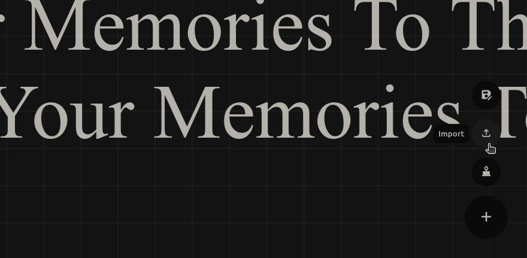

# Memory Board

## Visão Geral
Essa é uma aplicação frontend que reimagina o conceito tradicional de *"Memory Board"* em um ambiente digital. Originalmente, um Memory Board é uma ferramenta física usada para organizar e exibir memórias visuais, como fotos, cartões postais e lembranças. Ele serve como um lembrete tangível de momentos especiais, experiências significativas ou mesmo personalidades importantes na vida de alguém.

Seu objetivo principal é fornecer aos usuários uma plataforma digital onde eles possam:

- **Capturar Memórias:** Os usuários podem realizar o upload de suas memórias, ou seja, arquivos de imagens.

- **Organizá-las:** A aplicação permite que os usuários organizem suas imagens de forma personalizada, semelhante à disposição física tradicional.

- **Persisti-las:** Através do uso do LocalStorage, o Memory Board garante que as memórias permaneçam acessíveis e intocadas entre sessões de uso.

Este projeto é desenvolvido como parte de um esforço para aprimorar minhas habilidades de desenvolvimento frontend e serve como um exemplo prático das tecnologias e técnicas que domino. É também uma expressão do meu apreço pela nostalgia e pelo poder da memória e portanto da história em nossa vida cotidiana.

## Sumário
- [Visão Geral](#visão-geral)
- [Sumário](#sumário)
- [Produção](#produção)
- [Tecnologias Utilizadas](#tecnologias-utilizadas)
- [Principais Features](#principais-features)
  - [1. Componente de Dropzone](#1-componente-de-dropzonecomponente-de-dropzone)
  - [2. State Management com Zustand](#2-state-management-com-zustand)

## Produção
Essa aplicação está disponível em ambiente de produção, pela **[Vercel](https://vercel.com/)**, através do link abaixo:

### [memoryboardio.vercel.app](https://memoryboardio.vercel.app)

## Tecnologias Utilizadas

  

  

  

  

  

  

  

## Principais Features

### 1. Componente de Dropzone
A principal feature dessa aplicação é sem dúvidas a capacidade do usuário realizar o envio de suas memórias, ou seja, seus arquivos de imagem.

Ele pode fazê-lo de duas maneiras, arrastando as imagens para o menu de importação, ou simplesmente clicando no mesmo menu.

  

  > Preview do botão responsável pela operação de importação.

  

  > Preview do modal de importação.

#####
Isso tudo é possível graças ao framework **[React Dropzone](https://react-dropzone.js.org/)**, que facilita a implementação do `<input />` responsável por realizar o upload dos arquivos.

Essa implementação em código fica assim:

  

  > Bloco de código jsx que desestrutura alguns dos objetos retornados pelo custom hook useDropzone, que serão utilizados no jsx e em outras funções.

 

  > Bloco de código jsx utilizando os objetos retornados pelo método getRootProps() e getInputProps() do custom hook useDropzone.

## 2. State Management com Zustand

Após as imagens serem importadas, é necessário lidar com elas, para que possam ser acessadas por outros componentes.

Para tal, fora utilizado o framework **Zustand**, criando algumas *Stores*, dentre as quais, a `polaroidStore`, que trata os dados de importação.

  

  > Zustand store responsável pelos arquivos importados.

  

  > Importação do custom hook no componente Dropzone.

Assim, utilizando uma *Handler Function*, os arquivos importados, salvos no array `acceptedFiles` são salvos "globalmente", ao utilizar o método `addPolarids`:

  

  > Utilização do método `addPolaroids`, através da função, handleUploads.

Isso faz com que o anterior array de `Files`(`acceptedFiles`), retornado pelo hook `useDropzone`, seja mapeado como um novo array do tipo `PolaroidObject`, apresentado no bloco de código da `polaroidStore` agora com novas informações.
